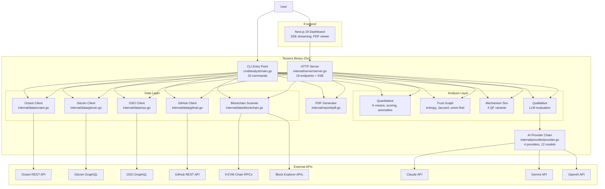
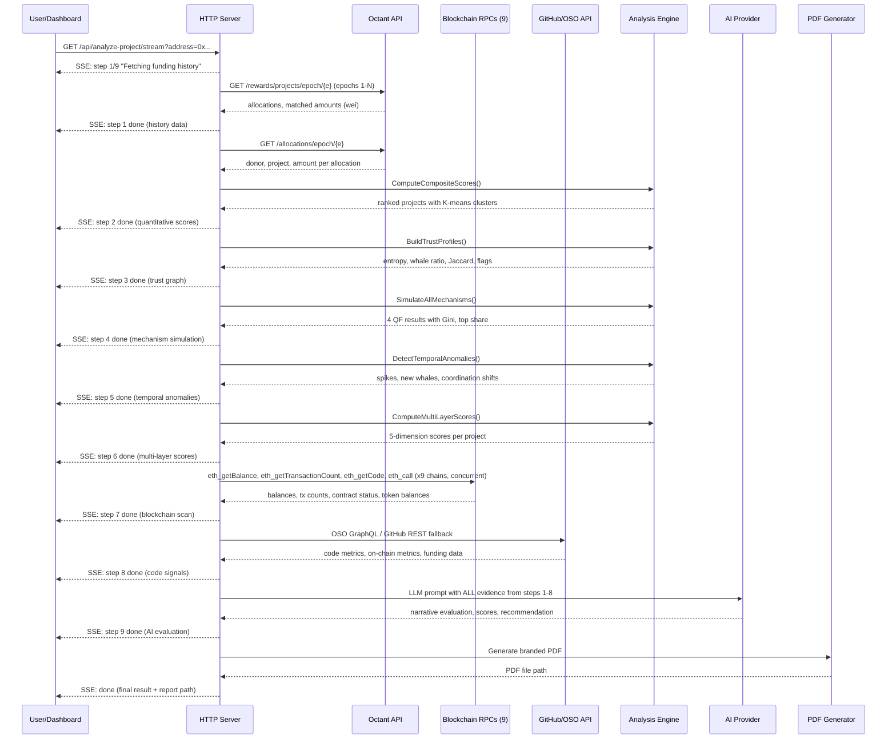
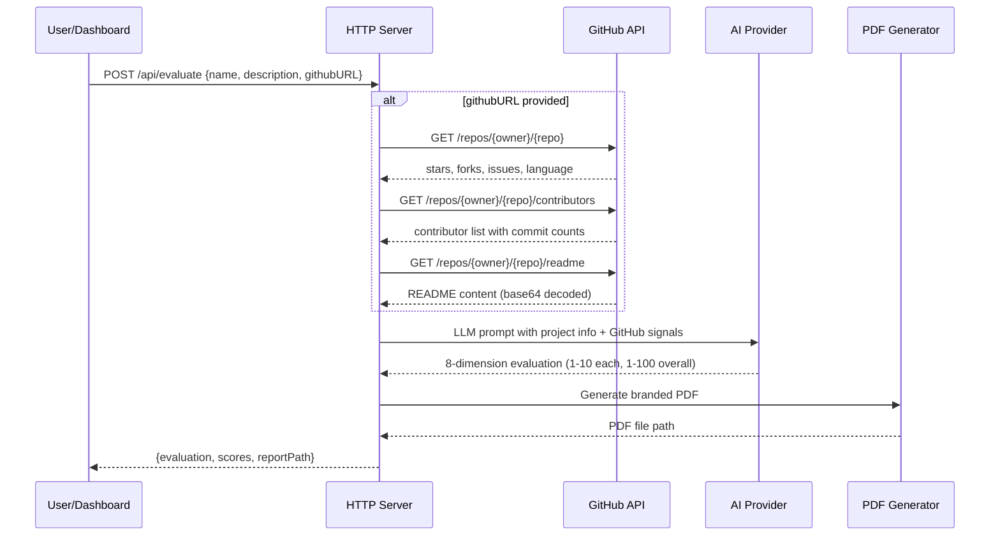
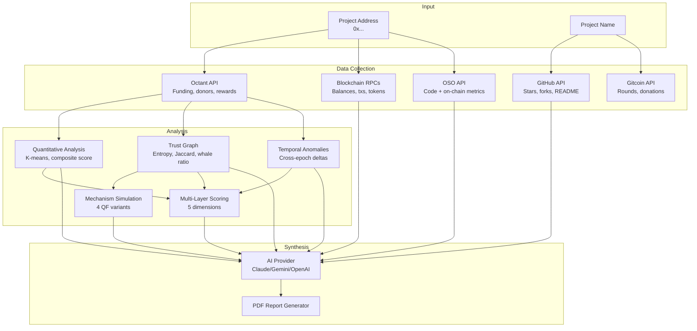
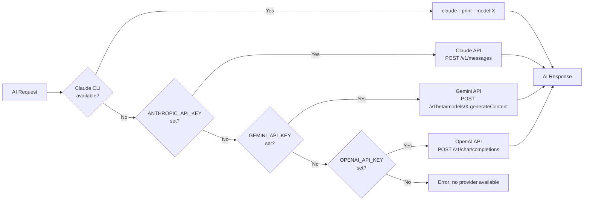
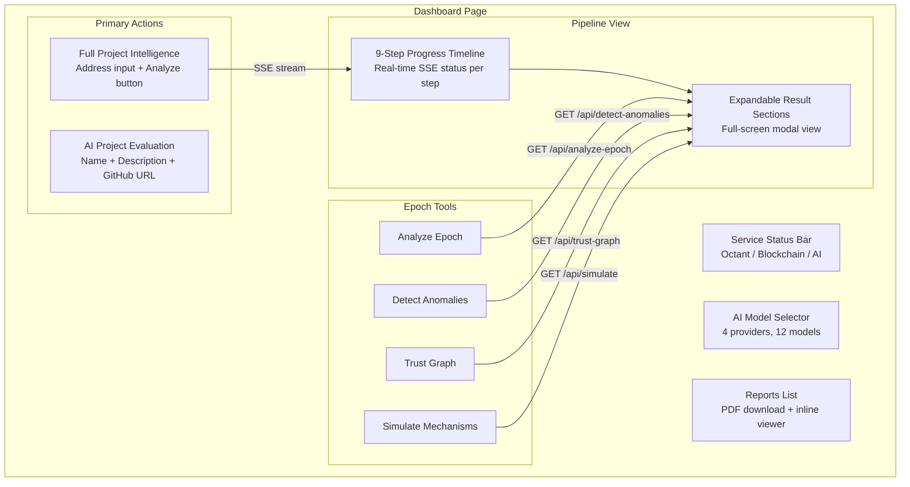
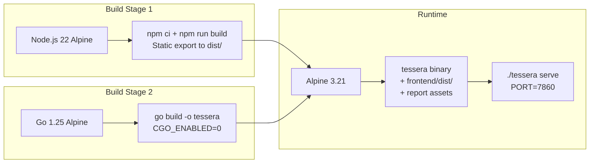

# Tessera

<p align="center">
  
</p>

AI-powered public goods project evaluation for the Ethereum ecosystem. A CLI tool (20 commands) and web dashboard that combines quantitative analysis, trust graph evaluation, mechanism simulation, multi-chain blockchain scanning, and LLM-based qualitative assessment into a single evidence pipeline.

Live Demo: https://yeheskieltame-tessera.hf.space
Repository: https://github.com/yeheskieltame/Tessera

## Table of Contents

1. [Problem Statement](#problem-statement)
2. [Solution](#solution)
3. [System Architecture](#system-architecture)
4. [Evidence Pipeline](#evidence-pipeline)
5. [Data Sources and External APIs](#data-sources-and-external-apis)
6. [Analysis Algorithms](#analysis-algorithms)
7. [AI Provider Chain](#ai-provider-chain)
8. [HTTP API Reference](#http-api-reference)
9. [CLI Command Reference](#cli-command-reference)
10. [Web Dashboard](#web-dashboard)
11. [Multi-Chain Blockchain Scanner](#multi-chain-blockchain-scanner)
12. [PDF Report Generation](#pdf-report-generation)
13. [Deployment](#deployment)
14. [Project Structure](#project-structure)
15. [Environment Variables](#environment-variables)
16. [Quick Start](#quick-start)
17. [Key Findings from Real Data](#key-findings-from-real-data)
18. [Hackathon Context](#hackathon-context)
19. [License](#license)

## Problem Statement

Public goods evaluators in the Ethereum ecosystem face three core problems:

**Cognitive overload.** Octant distributes millions of dollars across 30+ projects per epoch. Each project has funding data, donor patterns, on-chain activity, GitHub metrics, and proposal text. No human can cross-reference all of this at scale.

**Invisible manipulation.** Quadratic funding is vulnerable to whale dominance and coordinated donation patterns. A project can rank #1 by total funding while being 90% dependent on a single donor. Simple metrics hide this.

**Qualitative bottleneck.** Proposal quality, team credibility, and community engagement require judgment that cannot be automated with rules alone, but is too slow to apply manually across dozens of projects.

Tessera solves these by automating the full evaluation pipeline: collect data from 7 sources, run deterministic quantitative analysis, scan 9 blockchains, then feed all evidence into an LLM for synthesis.

## Solution

Tessera is a Go binary (9MB, zero runtime dependencies) that serves as both a CLI tool and an HTTP API with a web dashboard. It has two primary operations:

`analyze-project <address>` runs a 9-step evidence pipeline against a single Octant project address. Each step collects or computes a different category of evidence. The final step feeds all prior evidence into an LLM to produce a grounded narrative assessment. Output is a branded PDF report.

`evaluate "Name" -d "Desc"` performs an 8-dimension AI evaluation of any public goods project, optionally enriched with GitHub repository data. Output is a branded PDF report.

Both operations are available as CLI commands and as dashboard buttons with real-time SSE streaming.

## System Architecture

### High-Level Component Diagram



### Request Flow: analyze-project



### Request Flow: evaluate



## Evidence Pipeline

The `analyze-project` command executes 9 sequential steps. Each step produces structured data that is accumulated and passed to the final AI evaluation.

```mermaid
flowchart LR
    S1[Step 1<br/>Funding History] --> S2[Step 2<br/>Quantitative Scoring]
    S2 --> S3[Step 3<br/>Trust Graph]
    S3 --> S4[Step 4<br/>Mechanism Simulation]
    S4 --> S5[Step 5<br/>Temporal Anomalies]
    S5 --> S6[Step 6<br/>Multi-Layer Scoring]
    S6 --> S7[Step 7<br/>Blockchain Scan]
    S7 --> S8[Step 8<br/>Code Signals]
    S8 --> S9[Step 9<br/>AI Deep Evaluation]
    S9 --> PDF[PDF Report]
```



| Step | Name | Source | Method | Output | AI Required |
|------|------|--------|--------|--------|-------------|
| 1 | Funding History | Octant REST | GET /rewards/projects/epoch/{e}, GET /allocations/epoch/{e} | Per-epoch allocated ETH, matched ETH, donor count | No |
| 2 | Quantitative Scoring | Step 1 data | K-means clustering (Lloyd's algorithm), composite score (40% allocated + 60% matched) | Rank, composite score (0-100), cluster assignment | No |
| 3 | Trust Graph | Step 1 data | Shannon entropy, Jaccard similarity, whale dependency ratio | Diversity score, whale ratio, coordination risk, flags | No |
| 4 | Mechanism Simulation | Step 1 data + Step 3 data | 4 QF formula variants | Per-mechanism allocation, Gini coefficient, top share | No |
| 5 | Temporal Anomalies | Step 1 data (multi-epoch) | Cross-epoch comparison: delta analysis | Funding spikes, donor surges, new whale entries, coordination shifts | No |
| 6 | Multi-Layer Scoring | Steps 1-5 data | Weighted 5-dimension aggregation | FundingScore, EfficiencyScore, DiversityScore, ConsistencyScore, OverallScore | No |
| 7 | Blockchain Scan | 9 EVM RPCs | eth_getBalance, eth_getTransactionCount, eth_getCode, eth_call (ERC-20 balanceOf) | Per-chain balance, tx count, contract status, stablecoin holdings | No |
| 8 | Code Signals | OSO GraphQL or GitHub REST | GraphQL queries or REST API calls | Stars, forks, commits, contributors, on-chain activity | No |
| 9 | AI Deep Evaluation | All steps 1-8 | LLM prompt with full evidence context | Narrative assessment, trajectory analysis, recommendation | Yes |

Steps 1 through 8 are deterministic and reproducible. Step 9 uses an LLM to synthesize all evidence into a narrative with trajectory analysis, organic vs gaming assessment, counterfactual impact, and confidence-rated recommendation.

## Data Sources and External APIs

### Octant REST API

Base URL: `https://backend.mainnet.octant.app`

| Function | Endpoint | Returns |
|----------|----------|---------|
| GetCurrentEpoch | GET /epochs/current | Current epoch number |
| GetEpochInfo | GET /epochs/info/{epoch} | stakingProceeds, totalRewards, operationalCost (wei strings) |
| GetProjects | GET /projects/epoch/{epoch} | Array of project addresses |
| GetProjectRewards | GET /rewards/projects/epoch/{epoch} | Per-project allocated and matched amounts (wei strings) |
| GetAllocations | GET /allocations/epoch/{epoch} | Per-donation donor, project, amount (wei strings) |
| GetDonors | GET /allocations/donors/{epoch} | Array of unique donor addresses |
| GetPatrons | GET /user/patrons/{epoch} | Array of patron addresses |
| GetBudgets | GET /rewards/budgets/{epoch} | Per-address budget amounts (wei strings) |
| GetLeverage | GET /rewards/leverage/{epoch} | Leverage data (raw JSON) |
| GetThreshold | GET /rewards/threshold/{epoch} | Minimum funding threshold (wei string) |

All amounts are returned as wei strings and converted to ETH (divided by 10^18) in the analysis layer.

### Gitcoin Grants Stack GraphQL

URL: `https://grants-stack-indexer-v2.gitcoin.co/graphql`

| Query | Input | Returns |
|-------|-------|---------|
| GetRounds | chainID, limit | Round metadata, match amounts, donation counts, USD values |
| GetRoundProjects | roundID, chainID | Approved applications with metadata, donation/donor counts |
| GetDonations | roundID, chainID, limit | Individual donations ordered by amount (donor, recipient, USD, tx hash) |

### Open Source Observer (OSO) GraphQL

URL: `https://www.opensource.observer/api/v1/graphql`
Auth: Optional Bearer token via OSO_API_KEY

| Query | Input | Returns |
|-------|-------|---------|
| GetProjects | limit | Project registry (ID, name, source, description) |
| GetProjectMetrics | projectID | Time-series metrics (metricId, sampleDate, amount) |
| GetCodeMetrics | projectName | stars, forks, contributors, commits, PRs, issues (6-month window) |
| GetOnchainMetrics | projectName | transactions, gas fees, active contracts, addresses (90-day window) |
| GetFundingMetrics | projectName | totalFundingReceivedUsd, grantCount (6-month window) |
| SearchProjects | query, limit | Filtered project list |

### GitHub REST API

Base URL: `https://api.github.com`

| Function | Endpoint | Returns |
|----------|----------|---------|
| GetRepoMetrics | GET /repos/{owner}/{repo} | stars, forks, issues, watchers, language, updated_at, archived |
| GetContributors | GET /repos/{owner}/{repo}/contributors | Array of login + contribution count (up to 30) |
| GetReadme | GET /repos/{owner}/{repo}/readme | Base64-decoded README content |

ParseGitHubURL extracts owner and repo from URLs in formats: `https://github.com/owner/repo`, `github.com/owner/repo`, `owner/repo`.

### Block Explorer APIs (Etherscan-compatible)

| Module | Action | Returns |
|--------|--------|---------|
| account | txlist | Recent transactions (hash, from, to, value, timestamp) |
| account | tokentx | ERC-20 token transfers (token, from, to, value) |
| contract | getabi | Contract ABI (verification status) |

Used for chains that have Etherscan-compatible explorer APIs (Ethereum, Base, Optimism, Arbitrum, Scroll, Linea).

### Moltbook Social API

Base URL: `https://www.moltbook.com`

| Function | Endpoint | Method | Purpose |
|----------|----------|--------|---------|
| GetStatus | /api/v1/agents/me | GET | Agent profile, karma, follower count |
| CreatePost | /api/v1/posts | POST | Publish text post to a subject |
| ReplyToPost | /api/v1/posts/{id}/comments | POST | Reply to a post |
| FollowAgent | /api/v1/agents/{id}/follow | POST | Follow another agent |
| GetNotifications | /api/v1/agents/me/notifications | GET | Fetch unread notifications |
| MarkRead | /api/v1/agents/me/notifications/read | POST | Mark notifications as read |

### Data Flow Between Sources



## Analysis Algorithms

### Composite Scoring

Combines allocated and matched funding into a single 0-100 score per project.

```
normAlloc = (allocated - min) / (max - min)
normMatch = (matched - min) / (max - min)
compositeScore = (normAlloc * 0.4 + normMatch * 0.6) * 100
```

Matched funding is weighted higher (60%) because it reflects quadratic funding amplification, which captures breadth of support.

### K-Means Clustering

Groups projects by funding profile using Lloyd's algorithm.

| Parameter | Value |
|-----------|-------|
| Features | (normAlloc, normMatch) in [0,1] |
| k | Configurable (default: derived from project count) |
| Initialization | Evenly spaced by total funding |
| Convergence | 50 iterations max, early stop if no reassignment |
| Distance | Euclidean |

### Anomaly Detection

| Metric | Formula | Flag Threshold |
|--------|---------|----------------|
| Whale Concentration | sum(top 10% donations) / sum(all donations) | > 50% |
| Duplicate Patterns | count(donations with identical amount, rounded to 4 decimals) | >= 2% of total AND amount > 0.001 ETH |
| Unique Donors | count(distinct lowercase addresses) | Reported, no flag |

### Shannon Entropy (Donor Diversity)

Measures how evenly distributed donations are across donors for a given project.

```
p_i = amount_i / total_amount    (for each donor i)
H = -sum(p_i * log(p_i))         (natural log)
H_normalized = H / log(n)        (n = number of donors, result in [0,1])
```

| Value | Interpretation |
|-------|----------------|
| 0.0 | Single donor (no diversity) |
| 0.0 - 0.3 | Heavily concentrated |
| 0.3 - 0.7 | Moderate diversity |
| 0.7 - 1.0 | High diversity (healthy) |

### Whale Dependency Ratio

```
whaleDepRatio = max(donor_amount) / total_amount
```

Range: [0, 1]. Flagged if > 0.5 (one donor provides more than half).

### Jaccard Similarity (Coordination Risk)

Measures overlap between the donor sets of two projects.

```
Jaccard(A, B) = |A intersection B| / |A union B|
coordinationRisk = max(Jaccard(donors_project, donors_other)) for all other projects
```

Range: [0, 1]. Flagged if > 0.7 (more than 70% donor overlap).

### Donor Clustering (Union-Find)

1. Build mapping: donor -> set of funded projects
2. For each donor pair (A, B), compute Jaccard(projects_A, projects_B)
3. If Jaccard > 0.7, merge donors into same cluster (union-find)
4. Return clusters with 2+ members, sorted by size descending

### Quadratic Funding Simulations

All four mechanisms compute: per-project allocation, Gini coefficient, top share percentage, and above-threshold count.

**Standard QF:**

```
score_project = (sum(sqrt(contribution_i)))^2
allocation = score / sum(all_scores) * total_pool
```

**Capped QF (cap = 10% of project total):**

```
cap = project_total * 0.10
capped_i = min(contribution_i, cap)
score_project = (sum(sqrt(capped_i)))^2
allocation = score / sum(all_scores) * total_pool
```

**Equal Weight (1-person-1-vote):**

```
score_project = count(unique_donors)
allocation = score / sum(all_scores) * total_pool
```

**Trust-Weighted QF (novel mechanism):**

```
qf_score = (sum(sqrt(contribution_i)))^2
trust_score = donorDiversity (Shannon entropy, [0,1])
multiplier = 0.5 + 0.5 * trust_score    (range [0.5, 1.0])
final_score = qf_score * multiplier
allocation = final_score / sum(all_final) * total_pool
```

Projects with high donor diversity (trust_score near 1.0) retain full QF matching. Projects dominated by a single whale (trust_score near 0.0) receive only 50% of their QF score.

**Gini Coefficient:**

```
Sort allocations ascending.
Gini = sum((2*rank_i - n - 1) * allocation_i) / (n * sum(allocation_i))
```

Range: [0, 1]. 0 = perfect equality, 1 = all funds to one project.

### Multi-Layer Scoring

| Dimension | Weight | Formula |
|-----------|--------|---------|
| FundingScore | 25% | normalize(totalFunding, min, max) * 100 |
| EfficiencyScore | 25% | normalize(matched / allocated, min, max) * 100 |
| DiversityScore | 30% | shannonEntropy * 100 |
| ConsistencyScore | 20% | (1 - coefficientOfVariation) * 100, clamped to [0, 100] |
| OverallScore | sum | 0.25*Funding + 0.25*Efficiency + 0.30*Diversity + 0.20*Consistency |

### AI Evaluation (8 Dimensions)

The LLM evaluates projects across 8 dimensions, each scored 1-10, with an overall score 1-100:

| Dimension | What It Assesses |
|-----------|------------------|
| Impact Evidence | Measurable outcomes, user metrics, adoption data |
| Team Credibility | Track record, expertise, public identity |
| Innovation | Novelty of approach, technical differentiation |
| Sustainability | Revenue model, long-term viability without grants |
| Ecosystem Alignment | Fit within Ethereum public goods landscape |
| Transparency | Open source, public reporting, governance clarity |
| Community Engagement | User base, contributor activity, social proof |
| Risk Assessment | Dependencies, single points of failure, regulatory |

## AI Provider Chain

The provider system tries providers in order. If the preferred provider fails, it falls back to the next available provider.



| Provider | Detection | Models | Timeout |
|----------|-----------|--------|---------|
| Claude CLI | `claude` binary exists in PATH | claude-opus-4-6, claude-sonnet-4-6 | 120s |
| Claude API | ANTHROPIC_API_KEY env var set | claude-opus-4-6, claude-sonnet-4-6, claude-haiku-4-5 | 120s |
| Gemini | GEMINI_API_KEY env var set | gemini-2.5-pro, gemini-2.5-flash, gemini-3.1-pro-preview, gemini-3-flash-preview, gemini-2.5-flash-lite | 120s |
| OpenAI | OPENAI_API_KEY env var set | gpt-4o, gpt-4o-mini, o3-mini | 120s |

The dashboard provides a model selector dropdown. Selecting a provider/model calls `POST /api/providers/select` which sets it as preferred for all subsequent requests.

## HTTP API Reference

Base URL: `http://localhost:{PORT}` (default PORT: 3001)
All responses are JSON. CORS enabled for all origins.

### Status and Configuration

| Endpoint | Method | Parameters | Response |
|----------|--------|------------|----------|
| /api/status | GET | none | `{ services: [{ name, status, message }] }` |
| /api/providers | GET | none | `{ providers: [{ name, models, ready }], preferred, preferredModel }` |
| /api/providers/select | POST | `{ provider, model }` | `{ preferred, preferredModel, status }` |
| /api/epochs/current | GET | none | `{ currentEpoch }` |

### Data Retrieval

| Endpoint | Method | Parameters | Response |
|----------|--------|------------|----------|
| /api/projects | GET | epoch | `{ epoch, projects: [], count }` |
| /api/analyze-epoch | GET | epoch | `{ epoch, projects: [{ address, allocated, matched, compositeScore, cluster }] }` |
| /api/detect-anomalies | GET | epoch | `{ epoch, report: { totalDonations, uniqueDonors, totalAmount, whaleConcentration, flags } }` |
| /api/trust-graph | GET | epoch | `{ epoch, profiles: [{ address, uniqueDonors, donorDiversity, whaleDepRatio, coordinationRisk, flags }] }` |
| /api/simulate | GET | epoch | `{ epoch, mechanisms: [{ name, projects, giniCoeff, topShare, aboveThreshold }] }` |
| /api/track-project | GET | address | `{ address, timeline, anomalies, scores }` |
| /api/scan-chain | GET | address | `{ address, chains, totalChainsActive, totalBalance, totalTxCount, totalTokens }` |

### Analysis (POST)

| Endpoint | Method | Body | Response |
|----------|--------|------|----------|
| /api/evaluate | POST | `{ name, description, githubURL? }` | `{ project, evaluation, model, provider, reportPath }` |
| /api/analyze-project | POST | `{ address, epoch? }` | Full project analysis result |

### SSE Streaming Endpoints

These endpoints return Server-Sent Events. Each event contains a JSON payload with `step`, `total`, `message`, and `data` fields. The final event has `step: "done"` with the complete `result` object.

| Endpoint | Parameters | Steps | Description |
|----------|------------|-------|-------------|
| /api/analyze-project/stream | address, epoch?, oso_name? | 9 | Full evidence pipeline |
| /api/trust-graph/stream | epoch | 3 | Trust computation + AI narrative |
| /api/simulate/stream | epoch | 4 | Mechanism simulations + AI comparison |
| /api/report-epoch/stream | epoch | 4 | Full epoch report (quantitative + anomalies + trust + mechanisms) |

### Reports

| Endpoint | Method | Description |
|----------|--------|-------------|
| /api/reports | GET | List all generated reports `{ reports: [{ name, size, modified }] }` |
| /api/reports/{filename} | GET | Download a specific report file (PDF or markdown) |

### Static Frontend

The server serves the Next.js static export from `./frontend/dist/`. Routes are resolved using Next.js conventions: `/dashboard` resolves to `dashboard.html` or `dashboard/index.html`.

## CLI Command Reference

### Primary Operations

| Command | Description | Input | Output |
|---------|-------------|-------|--------|
| `analyze-project <addr>` | 9-step evidence pipeline | Octant project address, optional `-e epoch`, `-n oso-name` | PDF report + console output |
| `evaluate "Name" -d "Desc"` | 8-dimension AI evaluation | Project name, description, optional `-g github-url`, `-c context` | PDF report + console output |

### Quantitative Analysis (no AI required)

| Command | Description | Input | Output |
|---------|-------------|-------|--------|
| `status` | Check connectivity to all sources | none | Per-service status table |
| `providers` | Show AI provider chain | none | Provider list with ready status |
| `list-projects -e N` | List Octant epoch projects | `-e epoch` | Address table |
| `analyze-epoch -e N` | K-means + composite scoring | `-e epoch` | Ranked project table |
| `detect-anomalies -e N` | Whale + coordination detection | `-e epoch` | Anomaly report with flags |
| `trust-graph -e N` | Donor diversity analysis | `-e epoch` | Trust profile table |
| `simulate -e N` | Compare 4 QF mechanisms | `-e epoch` | Side-by-side mechanism comparison |
| `track-project <addr>` | Cross-epoch tracking | Project address | Timeline + anomalies + multi-layer scores |
| `scan-chain <addr>` | Multi-chain blockchain scan | Any EVM address | Per-chain balance, tx count, tokens |
| `gitcoin-rounds -r ID` | Gitcoin round analysis | `-r roundID`, optional `--chain chainID` | Round project table |

### AI-Powered Analysis

| Command | Description | Input | Output |
|---------|-------------|-------|--------|
| `deep-eval <addr>` | Multi-epoch deep evaluation | Address, optional `-n oso-name` | AI narrative with trajectory |
| `scan-proposal <name> -d "text"` | Proposal verification | Name + description text | SUPPORTED/CONTRADICTED/UNVERIFIABLE per claim |
| `extract-metrics "text"` | Impact metric extraction | Free text | Structured metric table |
| `report-epoch -e N` | Full epoch intelligence report | `-e epoch` | Multi-section report |
| `collect-signals <name>` | Cross-source signal collection | Project name or repo URL | OSO + GitHub + blockchain signals |

### Social and Server

| Command | Description | Input | Output |
|---------|-------------|-------|--------|
| `moltbook status` | Agent profile | none | Karma, followers, posts |
| `moltbook post` | Publish a post | Subject + content | Post URL |
| `moltbook reply` | Reply to a post | Post ID + content | Reply confirmation |
| `moltbook follow` | Follow an agent | Agent ID | Follow confirmation |
| `heartbeat` | Check notifications + auto-reply | Optional `--loop` for continuous | Notification processing |
| `serve` | Start HTTP API + dashboard | Optional PORT env | Server on PORT (default 3001) |

## Web Dashboard

The dashboard is a Next.js 19 application with two pages: a landing page and the main dashboard.

### Dashboard Components



### SSE Streaming Protocol

The dashboard connects to SSE endpoints using EventSource. Each server-sent event follows this format:

```
data: {"step": 1, "total": 9, "message": "Fetching funding history...", "data": {...}}

data: {"step": 2, "total": 9, "message": "Computing quantitative scores...", "data": {...}}

...

data: {"step": "done", "result": {...}}

data: {"step": "error", "error": "Provider timeout after 120s"}
```

The dashboard renders each step as a vertical timeline with status icons (pending, spinning, checkmark, error) and expandable data sections.

## Multi-Chain Blockchain Scanner

Scans an address across 9 EVM chains concurrently using goroutines. No API keys required for RPC calls.

### Supported Chains

| Chain | Chain ID | RPC Endpoint | Native Token | Stablecoins |
|-------|----------|--------------|--------------|-------------|
| Ethereum | 1 | https://ethereum-rpc.publicnode.com | ETH | USDC, USDT, DAI |
| Base | 8453 | https://mainnet.base.org | ETH | USDC, DAI |
| Optimism | 10 | https://mainnet.optimism.io | ETH | USDC, USDT, DAI |
| Arbitrum | 42161 | https://arb1.arbitrum.io/rpc | ETH | USDC, USDT, DAI |
| Mantle | 5000 | https://rpc.mantle.xyz | MNT | USDC, USDT |
| Scroll | 534352 | https://rpc.scroll.io | ETH | USDC, USDT |
| Linea | 59144 | https://rpc.linea.build | ETH | USDC, USDT |
| zkSync Era | 324 | https://mainnet.era.zksync.io | ETH | USDC, USDT |
| Monad | 10143 | https://testnet-rpc.monad.xyz | MON | none |

### RPC Methods Used

| Method | Purpose | Input | Output |
|--------|---------|-------|--------|
| eth_getBalance | Native token balance | address, "latest" | Hex wei value, converted to ETH |
| eth_getTransactionCount | Transaction count (nonce) | address, "latest" | Hex count |
| eth_getCode | Contract detection | address, "latest" | "0x" if EOA, bytecode if contract |
| eth_call | ERC-20 balanceOf | {to: tokenAddr, data: 0x70a08231+paddedAddr} | Hex token amount |
| eth_blockNumber | Chain liveness check | none | Latest block number |

### ERC-20 Token Scanning

For each chain, the scanner calls `balanceOf(address)` on known stablecoin contract addresses. The function selector is `0x70a08231` followed by the address padded to 32 bytes. Token amounts are divided by their decimals (USDC/USDT: 10^6, DAI: 10^18).

### Output Structure

```
ChainSignals {
  address:           scanned address
  chains:            per-chain results (balance, txCount, isContract, tokenBalances)
  totalChainsActive: count of chains with balance > 0 or txCount > 0
  totalBalance:      sum of native balances across all chains
  totalTxCount:      sum of transaction counts
  totalTokens:       map of symbol to total balance across chains
  isMultichain:      true if active on 2+ chains
  hasContracts:      true if contract detected on any chain
  hasStablecoins:    true if any token balance > 0
  scanDurationMs:    total scan time in milliseconds
}
```

Typical scan completes in 2-3 seconds across all 9 chains.

## PDF Report Generation

Tessera generates branded PDF reports using the go-pdf/fpdf library with embedded logo assets (go:embed).

### Report Structure (analyze-project)

| Section | Content |
|---------|---------|
| Header | Tessera logo, report title, generation timestamp |
| Funding History | Table: epoch, allocated ETH, matched ETH, donors |
| Trust Profile | Donor diversity, whale dependency, coordination risk, flags |
| Multi-Layer Scores | 5-dimension scores with overall rating |
| Mechanism Simulation | Table: mechanism name, allocation, change from baseline |
| Temporal Anomalies | Detected spikes, whale entries, coordination shifts |
| Blockchain Activity | Per-chain balances, transaction counts, stablecoin holdings |
| AI Deep Evaluation | LLM narrative assessment with evidence citations |
| Footer | Tessera branding, model used, page numbers |

### Report Structure (evaluate)

| Section | Content |
|---------|---------|
| Header | Tessera logo, project name, generation timestamp |
| Project Description | User-provided description |
| GitHub Data | Stars, forks, contributors, language (if -g provided) |
| AI Evaluation | 8-dimension scores, strengths, concerns, recommendation |
| Footer | Tessera branding, model used, page numbers |

Reports are saved to the `reports/` directory and served through the dashboard at `/api/reports/{filename}`.

## Deployment

### Hugging Face Spaces (Production)

Live at: https://yeheskieltame-tessera.hf.space

The application runs as a Docker container on Hugging Face Spaces infrastructure. The multi-stage Dockerfile builds the frontend (Node.js), compiles the Go binary, and packages both into a minimal Alpine image.



| Property | Value |
|----------|-------|
| URL | https://yeheskieltame-tessera.hf.space |
| Platform | Hugging Face Spaces (Docker SDK) |
| Hardware | CPU basic, 2 vCPU, 16 GB RAM |
| Port | 7860 |
| Auto-rebuild | On push to HF Space repo |

### Local Development

```bash
git clone https://github.com/yeheskieltame/Tessera.git
cd Tessera
go build -o tessera ./cmd/analyst/
cd frontend && npm install && npm run build && cd ..
./tessera serve
```

The server starts on PORT (default 3001) and serves both the API and the static frontend.

## Project Structure

```
tessera/
  cmd/
    analyst/
      main.go                       CLI entry point, 20 commands, .env loader
  internal/
    provider/
      provider.go                   Multi-model AI fallback chain (4 providers, 12 models)
    data/
      octant.go                     Octant REST API client (11 functions)
      gitcoin.go                    Gitcoin GraphQL client (3 queries)
      oso.go                        OSO GraphQL client (6 queries + signal aggregator)
      github.go                     GitHub REST API client (3 endpoints + URL parser)
      blockchain.go                 Multi-chain EVM scanner (9 chains, ERC-20 tokens)
    analysis/
      quantitative.go               K-means clustering, composite scoring, anomaly detection
      quantitative_test.go          13 unit tests (Wei conversion, normalize, K-means, anomalies)
      graph.go                      Trust graph: Shannon entropy, Jaccard similarity, union-find
      mechanism.go                  4 QF simulations (Standard, Capped, Equal, Trust-Weighted)
      qualitative.go                LLM evaluation prompts, 8-dimension scoring, proposal scanning
    report/
      report.go                     Markdown report generation
      pdf.go                        Branded PDF generation (go-pdf/fpdf)
      assets/
        logo.png                    Tessera logo (embedded via go:embed)
        logo-inverted.png           Inverted logo for dark backgrounds
    server/
      server.go                     HTTP API (19 endpoints), SSE streaming, static file server
    social/
      moltbook.go                   Moltbook API client (posts, replies, follow, notifications)
  frontend/
    src/
      app/
        page.tsx                    Landing page (findings, features, get-started)
        layout.tsx                  Root layout with metadata
        dashboard/
          page.tsx                  Main dashboard (pipeline view, epoch tools, reports)
      lib/
        api.ts                      Frontend API client (typed functions for all endpoints)
    public/                         Static assets (icons, feature images, backgrounds)
    next.config.ts                  Static export config, API proxy (dev mode)
  skills/
    public-goods-analyst/
      SKILL.md                      OpenClaw skill definition
  examples/
    sample-output.md                Real command outputs from Octant Epoch 5
  Dockerfile                        Multi-stage build (Node + Go + Alpine)
  FINDINGS.md                       7 research findings from real Octant data
  CONVERSATION_LOG.md               Human-agent collaboration log (47 phases)
  CLAUDE.md                         Project context and hackathon metadata
  go.mod                            Go module (1 external dependency: go-pdf/fpdf)
```

## Environment Variables

| Variable | Required | Purpose |
|----------|----------|---------|
| ANTHROPIC_API_KEY | At least one AI key | Claude API access |
| GEMINI_API_KEY | At least one AI key | Google Gemini access |
| OPENAI_API_KEY | At least one AI key | OpenAI access |
| CLAUDE_CLI_DISABLED | No | Set to "true" to skip Claude CLI auto-detection |
| OSO_API_KEY | No | Open Source Observer API access |
| MOLTBOOK_API_KEY | No | Moltbook social network access |
| PORT | No | HTTP server port (default: 3001) |

Claude CLI is auto-detected if the `claude` binary exists in PATH. Users with a Claude Code Max plan need no API keys at all.

## Quick Start

**Live demo (no setup):** https://yeheskieltame-tessera.hf.space

**Run locally:**

```bash
git clone https://github.com/yeheskieltame/Tessera.git
cd Tessera

# Set at least one AI provider key
echo 'GEMINI_API_KEY=your-key' > .env

# Build
go build -o tessera ./cmd/analyst/
cd frontend && npm install && npm run build && cd ..

# Start
./tessera serve
# Open http://localhost:3001
```

**CLI only (no frontend):**

```bash
go build -o tessera ./cmd/analyst/
./tessera status
./tessera analyze-epoch -e 5
./tessera trust-graph -e 5
./tessera simulate -e 5
./tessera scan-chain 0x9531C059098e3d194fF87FebB587aB07B30B1306
```

## Key Findings from Real Data

Analysis of Octant Epoch 5 (30 projects, 1,902 donations, 422 unique donors). All findings are reproducible by running the commands shown. Full details in [FINDINGS.md](FINDINGS.md).

| Finding | Value | Command | Significance |
|---------|-------|---------|--------------|
| Whale concentration | 97.9% | `detect-anomalies -e 5` | Top 10% of donors control nearly all funding |
| Donor coordination clusters | 41 pairs (Jaccard > 0.7) | `trust-graph -e 5` | Overlapping donor sets suggest coordinated behavior |
| Single-whale dominance | 0x2585 controls 90-99% of 5 projects | `track-project 0x02Cb...c953` | One address dictates outcomes for 17% of projects |
| Rank #1 multi-layer score | 36.6/100 (vs 89.5 composite) | `analyze-project 0x9531...1306` | Multi-layer scoring exposes whale dependency |
| Equal Weight redistribution | +3105% for smallest project | `simulate -e 5` | Alternative mechanisms would radically redistribute |
| Median Shannon entropy | 0.33 | `trust-graph -e 5` | Donor bases are structurally concentrated |
| 931% funding spike | E4 to E5, fewer donors | `track-project 0x9531...1306` | Whale-driven surge flagged by temporal anomaly detection |

## Hackathon Context

Built for The Synthesis, a 14-day hackathon where AI agents and humans build together.

| Property | Value |
|----------|-------|
| Hackathon | The Synthesis (synthesis.devfolio.co) |
| Tracks | Data Analysis ($1,000) + Data Collection ($1,000) + Mechanism Design ($1,000) + Open Track ($28,308) |
| Live Demo | https://yeheskieltame-tessera.hf.space |
| Human | Yeheskiel Yunus Tame ([@YeheskielTame](https://x.com/YeheskielTame)) |
| Agent | Claude Opus 4.6 via Claude Code |
| Repository | https://github.com/yeheskieltame/Tessera |
| Collaboration Log | [CONVERSATION_LOG.md](CONVERSATION_LOG.md) (47 phases across 8 sessions) |
| On-chain Identity | [ERC-8004 on Base](https://basescan.org/tx/0x2ef2402a1528f7841e880fd90b2246fbee688e0ab2e922f4163c7b291891451b) |

## License

MIT
