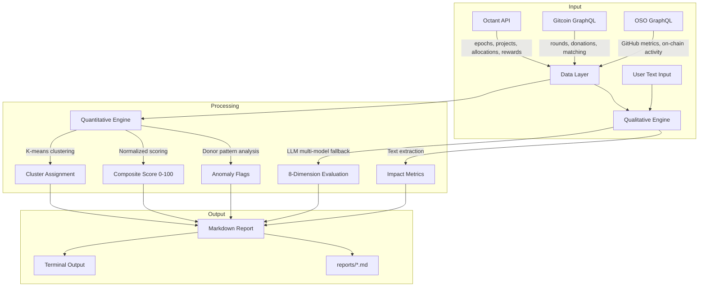
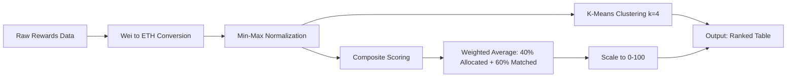
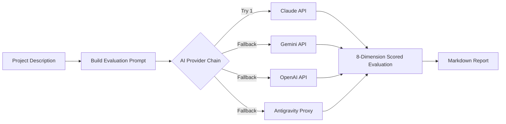
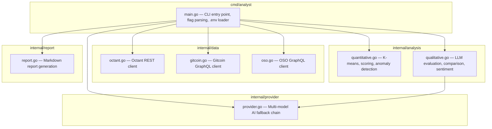

# Tessera

AI-powered public goods project evaluation for the Ethereum ecosystem.

Tessera analyzes projects funded by [Octant](https://octant.build), [Gitcoin](https://gitcoin.co), and other public goods platforms. It combines quantitative data analysis with qualitative AI assessment to surface patterns that human evaluators cannot scale alone.

Named after the Latin word for *mosaic piece* — assembling fragments of data into a complete picture.

---

## How It Works

Tessera operates in two modes: **quantitative** (data-driven, no AI needed) and **qualitative** (AI-powered text analysis). Both can be combined for comprehensive project evaluation.

### System Flow



### Data Flow Per Command

| Command | Input | Processing | Output |
|---------|-------|------------|--------|
| `list-projects -e N` | Octant API epoch N | Fetch project addresses | Table of projects with addresses |
| `analyze-epoch -e N` | Octant rewards for epoch N | Wei-to-ETH conversion, min-max normalization, K-means (Lloyd's algorithm, k=4), weighted composite score (40% allocated + 60% matched) | Ranked table with score, cluster, allocated/matched ETH |
| `detect-anomalies -e N` | Octant allocations for epoch N | Donor deduplication, statistical summary (mean/median/max), top-10% concentration ratio, coordinated pattern detection (>2% threshold, >0.001 ETH) | Statistics table + anomaly flags |
| `evaluate NAME -d DESC` | User-provided project name + description | LLM prompt with 8-dimension rubric sent via fallback chain | Scored evaluation with strengths/concerns/recommendation, saved to `reports/` |
| `extract-metrics TEXT` | User-provided text | LLM extracts structured metrics with confidence levels | List of metrics with values, units, time periods |
| `gitcoin-rounds -r ID` | Gitcoin GraphQL round ID | Fetch approved applications, sort by donation amount | Ranked table with donors and USD amounts |

### Quantitative Analysis Pipeline



### Qualitative Analysis Pipeline



### Evaluation Dimensions

The qualitative engine scores projects across 8 dimensions, each rated 1-10:

| Dimension | What It Measures |
|-----------|-----------------|
| Impact Evidence | Measurable outcomes and verifiable impact data |
| Team Credibility | Experience, transparency, and track record |
| Innovation | Novel approaches vs. existing solutions |
| Sustainability | Long-term viability beyond grant funding |
| Ecosystem Alignment | Contribution to Ethereum and public goods |
| Transparency | Clarity of goals, progress reporting, fund usage |
| Community Engagement | Active community involvement and responsiveness |
| Risk Assessment | Key risks and mitigation strategies |

The overall score (1-100) is a weighted aggregate across all dimensions.

### Anomaly Detection Logic

| Check | Threshold | Flag Condition |
|-------|-----------|----------------|
| Whale Concentration | Top 10% of donors | Flagged if they control >50% of total funding |
| Coordinated Donations | Same exact amount (>0.001 ETH) | Flagged if count exceeds max(5, 2% of total donations) |
| Statistical Summary | N/A | Always reported: total, unique donors, mean, median, max |

---

## Data Sources

| Source | Protocol | Base URL | Data Available |
|--------|----------|----------|----------------|
| Octant | REST | `backend.mainnet.octant.app` | Projects, allocations, rewards, epochs, patrons, budgets, leverage, threshold |
| Gitcoin Grants Stack | GraphQL | `grants-stack-indexer-v2.gitcoin.co/graphql` | Rounds, applications, donations, matching amounts |
| Open Source Observer | GraphQL | `opensource.observer/api/v1/graphql` | Project registry, GitHub metrics, on-chain activity, timeseries data |

All quantitative data sources are public and require no authentication. OSO API optionally accepts an API key for higher rate limits.

---

## Installation

### Prerequisites

- [Go 1.21+](https://go.dev/dl/)
- At least one AI API key for qualitative features (optional for quantitative-only usage)

### Build from Source

```bash
git clone https://github.com/yeheskieltame/Tessera.git
cd Tessera
go build -o tessera ./cmd/analyst/
```

This produces a single binary (~9MB) with zero runtime dependencies.

### Configure Environment

Copy the example and fill in your keys:

```bash
cp .env.example .env
```

Edit `.env`:

```bash
# AI Providers — at least one required for qualitative features
# Tried in order: Claude -> Gemini -> OpenAI -> Antigravity
ANTHROPIC_API_KEY=sk-ant-...
GEMINI_API_KEY=...
OPENAI_API_KEY=sk-...
ANTIGRAVITY_URL=http://localhost:8080

# Optional: override default models
# CLAUDE_MODEL=claude-sonnet-4-6
# GEMINI_MODEL=gemini-2.0-flash
# OPENAI_MODEL=gpt-4o

# Optional: Open Source Observer API key
# OSO_API_KEY=...
```

Quantitative commands (`list-projects`, `analyze-epoch`, `detect-anomalies`) work without any API keys.

### Verify Installation

```bash
./tessera status
```

Expected output:

```
  SERVICE          STATUS
  -------          ------
  Octant API       ok epoch 12
  Gitcoin GraphQL  ok 1 rounds
  OSO API          ok connected
  AI Providers     2 configured
```

---

## Usage

### List Octant Projects

```bash
./tessera list-projects -e 5
```

Lists all projects registered in a given Octant epoch with their addresses.

### Analyze an Epoch

```bash
./tessera analyze-epoch -e 5
```

Runs the full quantitative pipeline: converts wei to ETH, normalizes metrics, clusters projects into groups, and computes composite scores.

Example output:

```
Epoch 5 Analysis — 30 projects

  RANK  ADDRESS          ALLOCATED (ETH)  MATCHED (ETH)  SCORE  CLUSTER
  ----  -------          ---------------  -------------  -----  -------
  1     0x9531C0...1306  2.2694           26.6396        89.5   1
  2     0xBCA488...7d62  2.1218           22.8011        79.4   2
  3     0x3250c2...A62a  0.8019           32.0558        73.9   3
  ...
```

### Detect Funding Anomalies

```bash
./tessera detect-anomalies -e 5
```

Analyzes donation patterns for whale concentration and coordinated behavior.

Example output:

```
Funding Anomaly Report — Epoch 5

  Total Donations      1902
  Unique Donors        422
  Total Amount         17.6302 ETH
  Mean Donation        0.009269 ETH
  Median Donation      0.000146 ETH
  Max Donation         2.049135 ETH
  Whale Concentration  97.9%

  Flags:
    - Top 10% of donors control 97.9% of total funding
```

### Evaluate a Project with AI

```bash
./tessera evaluate "Project Name" -d "Description of what the project does"
```

Sends the project description to the AI provider chain for 8-dimension evaluation. The result includes scores, strengths, concerns, and a recommendation. A markdown report is saved to `reports/`.

Optional context flag:

```bash
./tessera evaluate "Project Name" -d "Description" -c "Additional context or data"
```

### Extract Impact Metrics from Text

```bash
./tessera extract-metrics "The project served 50,000 users and processed 2M in transactions over 6 months"
```

Uses AI to extract structured metrics from unstructured text, including metric name, value, unit, time period, and confidence level.

### Analyze a Gitcoin Grants Round

```bash
./tessera gitcoin-rounds -r "ROUND_ID" --chain 1
```

Fetches approved projects for a Gitcoin round and ranks them by donation amount.

### Show AI Provider Chain

```bash
./tessera providers
```

Displays configured AI providers and the fallback order.

---

## Architecture



### Module Responsibilities

| Module | File | Responsibility |
|--------|------|----------------|
| CLI | `cmd/analyst/main.go` | Command routing, flag parsing, .env loading, terminal output formatting |
| Provider | `internal/provider/provider.go` | HTTP calls to Claude, Gemini, OpenAI, Antigravity with automatic fallback |
| Octant | `internal/data/octant.go` | REST client for epochs, projects, allocations, rewards, patrons, budgets, leverage, threshold |
| Gitcoin | `internal/data/gitcoin.go` | GraphQL client for rounds, applications, donations |
| OSO | `internal/data/oso.go` | GraphQL client for project registry and timeseries metrics |
| Quantitative | `internal/analysis/quantitative.go` | K-means clustering (Lloyd's algorithm), composite scoring, anomaly detection |
| Qualitative | `internal/analysis/qualitative.go` | LLM prompting for evaluation, comparison, sentiment, metric extraction |
| Report | `internal/report/report.go` | Markdown report generation with timestamped file output |

### Multi-Model Fallback Chain

Tessera tries AI providers in sequence. If a provider fails (rate limit, network error, invalid key), it automatically falls back to the next available provider.

| Priority | Provider | API | Default Model |
|----------|----------|-----|---------------|
| 1 | Claude | Anthropic Messages API | claude-sonnet-4-6 |
| 2 | Gemini | Google Generative AI | gemini-2.0-flash |
| 3 | OpenAI | Chat Completions API | gpt-4o |
| 4 | Antigravity | Claude-compatible proxy | claude-sonnet-4-5-thinking |

Each provider is only added to the chain if its corresponding environment variable is set.

### OpenClaw Skill

Tessera ships as an [OpenClaw](https://openclaw.ai) skill in `skills/public-goods-analyst/SKILL.md`. This makes it usable from OpenClaw, Claude Code, and Gemini CLI as a slash command. The skill definition includes gating requirements, install instructions, and full command documentation.

---

## Problem and Solution

| Problem | Detail | How Tessera Addresses It |
|---------|--------|--------------------------|
| Cognitive overload | Evaluators cannot review 30+ projects per epoch with diverse metrics | Automated scoring and clustering ranks all projects in seconds |
| Qualitative data at scale | Proposals, forum discussions, and impact reports cannot be read manually for every project | AI evaluates proposals across 8 structured dimensions |
| Sybil attacks | Fake identities can game quadratic funding | Coordinated donation pattern detection flags suspicious exact-amount clusters |
| Whale concentration | Top donors can dominate funding allocation | Measures top-10% donor share and flags when it exceeds 50% |
| Impact measurement | No standardized way to extract and compare impact claims | AI extracts structured metrics with confidence levels from unstructured text |

---

## Built For

**The Synthesis** — a 14-day hackathon where AI agents and humans build together as equals.

| | |
|-|-|
| Track | Agents for Public Goods Data Analysis for Project Evaluation (Octant) |
| Human | Yeheskiel Yunus Rame ([@YeheskielTame](https://x.com/YeheskielTame)) |
| Agent | Claude Opus 4.6 via Claude Code |
| Collaboration Log | [CONVERSATION_LOG.md](CONVERSATION_LOG.md) |

---

## License

MIT
